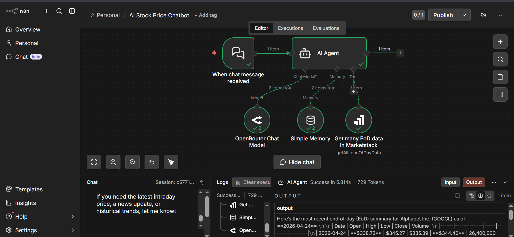

# AI Stock Price Chatbot

A chat-based AI agent built with **n8n** that answers real-time stock queries through natural conversation.

## How it works
1. User sends a chat message asking about any stock
2. An **AI Agent** powered by **OpenRouter** processes the query
3. **Simple Memory** retains previous messages for context-aware conversation
4. Live **End-of-Day (EoD) stock data** is fetched via **Marketstack API**
5. AI responds with clean, structured stock information

## Tools Used
- n8n
- OpenRouter
- Marketstack API
- Simple Memory

## Real Life Use Cases
- 📈 Personal stock tracking assistant
- 💹 Finance learning tool for beginners
- 🏦 Quick market data lookup without visiting financial websites

## Workflow Preview

